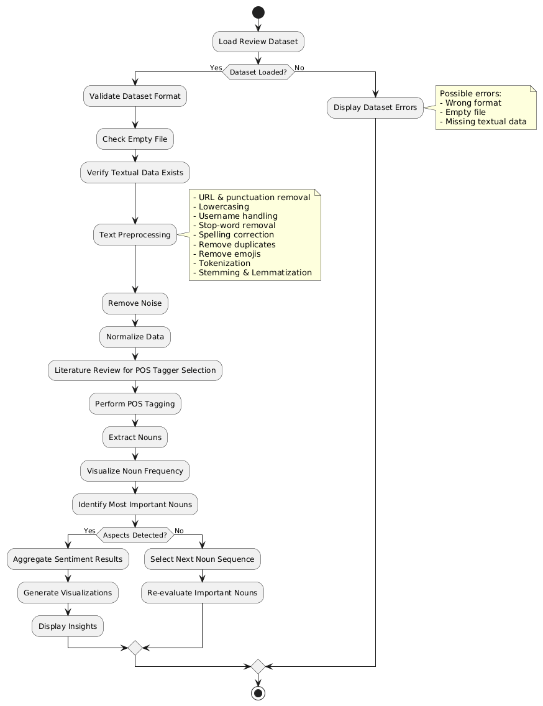
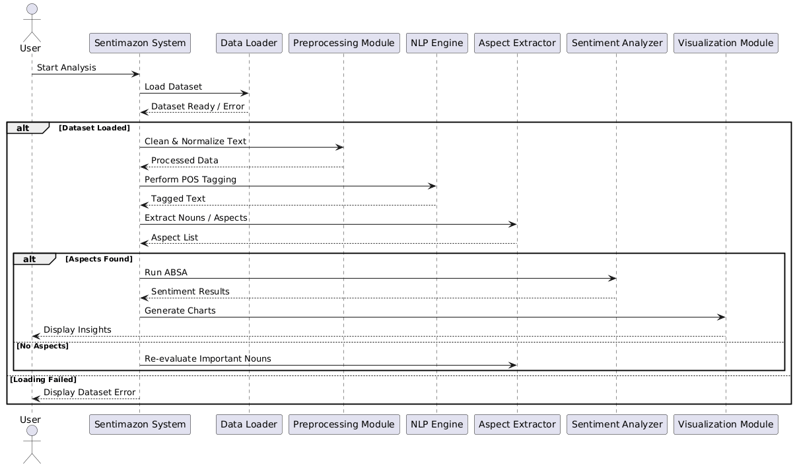
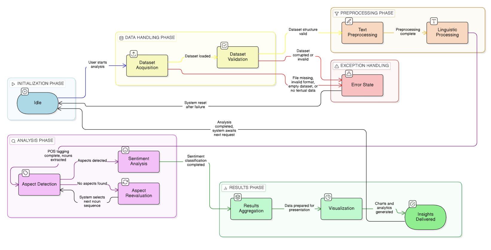

# Design

This section is presented the strategies applied to demonstrated requirements identified in the analysis. 

## Architecture 

The project, as a pipline-oriented analystics application, is implemented in python programing langage. The sentiamzon process the unstructured data by procceding steps in order to extract knowledge from the data. The arctecture of the Sentimazon consit of multipme components. The first step, data acuaistion, is responsible to read the stored data in CSV file including reviews from external resourceses such as Kaggle. The pre-processing step is perfromed in the next step in order to proucede the normalization of the textual data and remove noises from the further analysis. Following the preprocessing, the aspect based sentiment analysis is applied to extract the sentiment related to each aspect of sentiment. The sentiments are classified into three categories inclusing positive, negative, and neutral. At the final step, the visualization components is generated the graphical charts in otder to present the sentiments distributions and aspect frequency. The architecture is perfocmed and structured using python programming language, which is presenteded as follow.

## Modelling
The modelling section is designed based on the some core domain entities of Sentimazon including:
•	Review
•	Aspects of products
•	Sentiment
•	Dataset
•	Analyst
•	Results visualization
The Class Model is designed using the entities and their relationships. The model is presented, as follow.

This diagram focuses on:
•	Key aspects and associations
•	Core responsibilities
•	The system and structure related to it

## Interaction

The interaction section explains the way componentsof the project work together in order to excecute the sentiment anlaysis workflow. The program follows a data driven model that initiate from the user actions for sequence of task processing, starting from reading raw data into structured and insightful data. The interaction senarios inldude:
•	Upload and load customers online review through the system interface;
•	Validating unstructured dataset before the further analysis;
•	Pre-processing the unstructured textual data to mitigate errors and noises;
•	Procedding data analysis in order to extract the related and most frequenct aspects;
•	Assigning setiments realret to each review based on the extracted aspects;
•	Visualizing results using charts for the user and decision makers.
In order to demonsitrate the ineraction style, the sequence diagram is presented, as follow. At the beginning, unstructured data is submitted and in each step the data refine to be clear and usefull fo get resuls. The whole prcess is end by visualizing the final results related to the project. The interaction shows how the componets of the project in order to finish the seiminet anlsyis task of the project, which modular deisnging of the project make it easy to extend and improve the program.

## Behaviour

The behavoir of the project, sentimazon, is visualized using state driven anallitcal workflow. The whole process have a common entry point as dataset submitsion which start of the NLP pipeline and data transition throught stages.
Key ststem states include:
•	Idle
•	Validation of data (data format)
•	Textual data pre-proessing
•	Applying Part of Speech tags for each chunk of the reviews
•	Extract aspects
•	Aspect based sentiment analsysis
•	Aggregation of sentiments
•	Visualization of the results
•	dealing with issues throught the steps
The state diagram related to the project, sentiamazon, is presented, as follow. 

### Domain driven design (DDD) modelling

- Which are the bounded contexts of your domain? 
- Which are domain concepts (entities, value objects, aggregates, etc.) for each context?
- Are there repositories, services, or factories for each/any domain concept?
- What are the relavant domain events in each context?

> Context map diagrams are welcome here

### Object-oriented modelling

- What are the main data types (e.g. classes) of the system?
- What are the main attributes and methods of each data type?
- How do data types relate to each other?

> UML class diagrams are welcome here

### In case of a distributed system

- How do the domain concepts map to the architectural or infrastuctural components?
    + i.e. which architectural/component is responsible for which domain concept?
    + are there data types which are required onto multiple components? (e.g. messages being exchanged between components)

- What are the domain concepts or data types which represent the state of the distributed system?
    + e.g. state of a video game on central server, while inputs/representations on clients
    + e.g. where to store messages in an instant-messaging app? for how long?

- Are there domain concepts or data types which represent messages being exchanged between components?
    + e.g. messages between clients and servers, messages between servers, messages between clients

## Data-related aspects (in case persistent storage is needed)

- Is there any data that needs to be stored?
    - *What* data? *Where*? *Why*?

- How should **persistent data** be **stored**? Why?
    - e.g., relations, documents, key-value, graph, etc.

- Which components perform queries on the database?
    - *When*? *Which* queries? *Why*?
    - Concurrent read? Concurrent write? Why?

- Is there any data that needs to be shared between components?
    - *Why*? *What* data?

