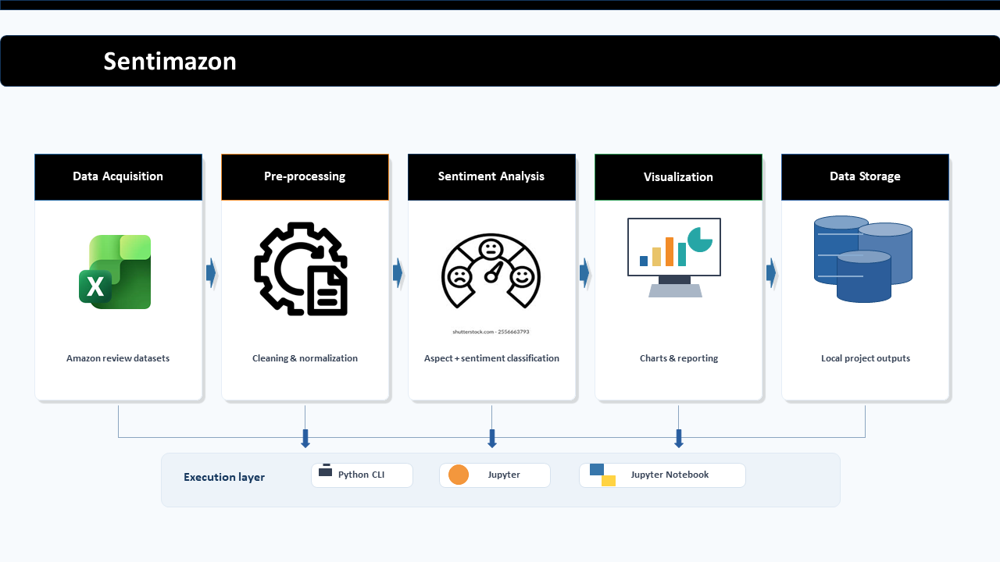
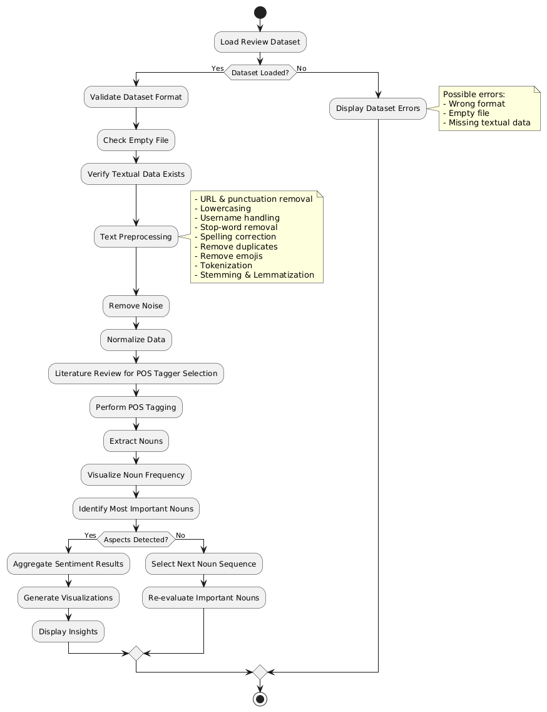
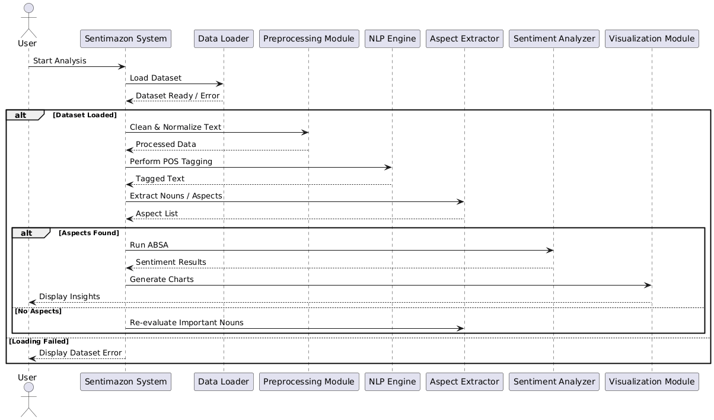
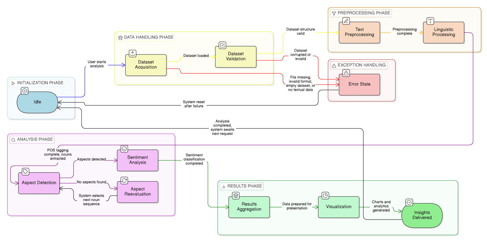

# Design

This section is presented the strategies applied to demonstrated requirements identified in the analysis. 

## Architecture 

The project is implemented as a pipeline-oriented data analytics application using Python. Sentimazon processes unstructured review data through several steps in order to extract useful information from customer opinions.

The architecture of Sentimazon consists of multiple components. The first step is data acquisition, which is responsible for reading the stored review data from a CSV file. The original idea was to collect reviews directly from Amazon, but due to policy and technical limitations related to web scraping, a publicly available mobile review dataset from Kaggle was used instead.

The second step is preprocessing. This step prepares the textual data for analysis by cleaning the reviews, normalizing the text, removing noise, removing stop words, applying tokenization, and applying lemmatization. This makes the review data more consistent and suitable for further Natural Language Processing tasks.

Following preprocessing, aspect extraction and sentiment analysis are applied. Product-related aspects are extracted from the review text, and sentiment analysis is used to classify reviews into positive, negative, and neutral categories. The project includes VADER and transformer-based sentiment models such as DistilBERT and RoBERTa.

At the final step, the evaluation and visualization components generate result tables and graphical charts. The evaluation component calculates performance metrics such as accuracy, precision, recall, and F1-score, while the visualization component presents aspect frequency and model performance.

The general architecture of the project is shown in the activity diagram below.


In the revised version of the project, the architecture was also improved from a Software Engineering perspective. The first version was mainly implemented inside a single Jupyter Notebook. In the revised version, the notebook remains as the execution interface, while the main logic is separated into reusable Python modules under `src/sentimazon`.

The main architectural components are:

| Component | Responsibility |
|---|---|
| Data loading | Loads the review dataset and selects the required columns |
| Preprocessing | Cleans review text, removes stop words, tokenizes text, and applies lemmatization |
| Aspect extraction | Extracts noun-based product aspects from the processed text |
| Sentiment analysis | Applies VADER, DistilBERT, and RoBERTa to classify sentiment |
| Evaluation | Computes accuracy, precision, recall, and F1-score |
| Visualization | Generates charts for aspect frequency and model performance |
| Notebook interface | Executes the workflow and displays intermediate and final outputs |

The revised module structure is:

```text
src/sentimazon/
├── data_loader.py
├── preprocessing.py
├── aspect_extraction.py
├── sentiment_analysis.py
├── evaluation.py
└── visualization.py
```

The general workflow is:

```text
Review dataset
→ Data loading
→ Text preprocessing
→ POS tagging
→ Aspect extraction
→ Sentiment analysis
→ Evaluation
→ Visualization
```

## Modelling
The modelling section is designed based on the some core domain entities of Sentimazon including:
•	Review
•	Aspects of products
•	Sentiment
•	Dataset
•	Analyst
•	Results visualization
The Class Model is designed using the entities and their relationships. The model is presented, as follow.



This diagram focuses on:
•	Key aspects and associations
•	Core responsibilities
•	The system and structure related to it

## Interaction

The interaction section explains the way componentsof the project work together in order to excecute the sentiment anlaysis workflow. The program follows a data driven model that initiate from the user actions for sequence of task processing, starting from reading raw data into structured and insightful data. The interaction senarios inldude:
•	Upload and load customers online review through the system interface;
•	Validating unstructured dataset before the further analysis;
•	Pre-processing the unstructured textual data to mitigate errors and noises;
•	Procedding data analysis in order to extract the related and most frequenct aspects;
•	Assigning setiments realret to each review based on the extracted aspects;
•	Visualizing results using charts for the user and decision makers.
In order to demonsitrate the ineraction style, the sequence diagram is presented, as follow. At the beginning, unstructured data is submitted and in each step the data refine to be clear and usefull fo get resuls. The whole prcess is end by visualizing the final results related to the project. The interaction shows how the componets of the project in order to finish the seiminet anlsyis task of the project, which modular deisnging of the project make it easy to extend and improve the program.



## Behaviour

The behavoir of the project, sentimazon, is visualized using state driven anallitcal workflow. The whole process have a common entry point as dataset submitsion which start of the NLP pipeline and data transition throught stages.
Key ststem states include:
•	Idle
•	Validation of data (data format)
•	Textual data pre-proessing
•	Applying Part of Speech tags for each chunk of the reviews
•	Extract aspects
•	Aspect based sentiment analsysis
•	Aggregation of sentiments
•	Visualization of the results
•	dealing with issues throught the steps
The state diagram related to the project, sentiamazon, is presented, as follow. 


